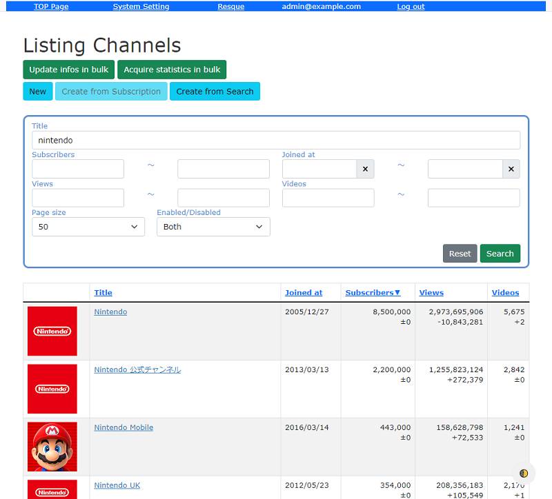
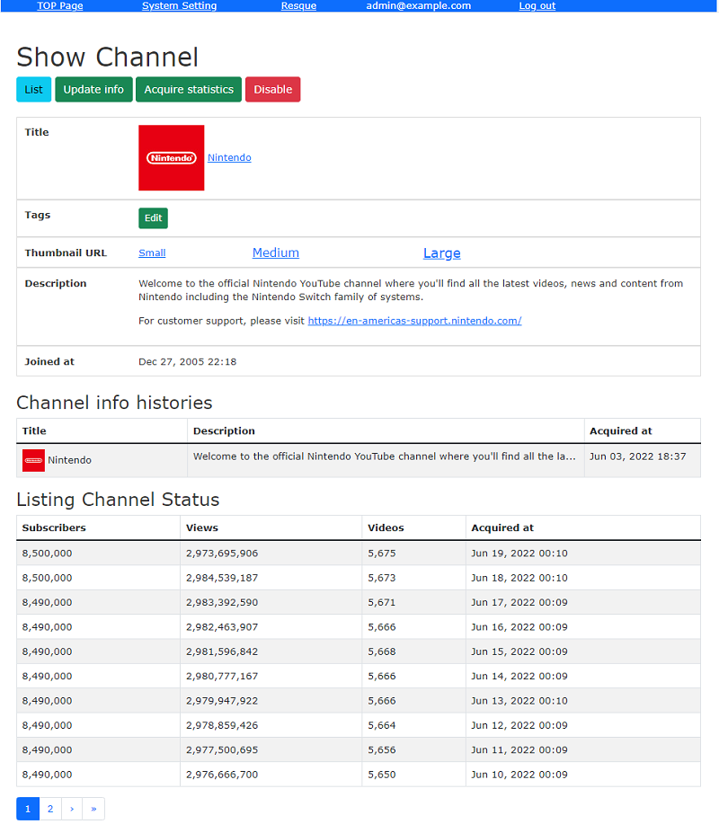

# YouTube API Trial

[](https://github.com/mishina2228/youtube-api-trial/actions)
[](https://codeclimate.com/github/mishina2228/youtube-api-trial/maintainability)
[](https://codecov.io/gh/mishina2228/youtube-api-trial)
[](https://github.com/mishina2228/youtube-api-trial/blob/master/LICENSE)
[](https://standardjs.com)
[](https://github.com/rubocop/rubocop)

YouTube channels info collector




## Prerequisites

- Ruby 3.2+
- Node.js 14.17.0+ || 16.0.0+
- Yarn 1.x+

## Installation

### Set up Rails app

First, install the gems and javascript packages required by the application:

- development

```sh
bundle install
yarn install
```

- production

```sh
bundle config set without development test
bundle install
yarn install --production
```

Next, execute the database migrations/schema setup:

```sh
RAILS_ENV=[RAILS_ENV] bin/rails db:setup
```

### Resque settings

Create a configuration file to manage [Resque](https://github.com/resque/resque)
and [resque-scheduler](https://github.com/resque/resque-scheduler)
with [God](http://godrb.com/)

```sh
RAILS_ENV=[RAILS_ENV] bundle exec itamae local config/itamae/resque.rb
```

Load configuration file

```sh
god -c /etc/god/master.conf
```

Resque, resque-scheduler operation with God

- check the status
- start
- restart
- stop

```sh
god status youtube_api_trial
god start youtube_api_trial
god restart youtube_api_trial
god stop youtube_api_trial
```

### Start the app

- development

```sh
bin/dev
```

- production

```sh
RAILS_ENV=production bin/rails assets:precompile
bin/rails s -e production
```

## Configuration Files

### Notify when Resque job failed

If a Resque job fails, a notification email will be sent.  
Please fill in the settings of email to `config/mail.yml`.  
The following is an example when sending from Gmail:

```yml
production:
  delivery_method: :smtp
  smtp_settings:
    address: 'smtp.gmail.com'
    port: 587
    domain: 'gmail.com'
    user_name: [USER_NAME]
    password: [PASSWORD]
    authentication: 'plain'
    enable_starttls_auto: true
```

## Contributing

1. Fork it
2. Create your feature branch (`git checkout -b my-new-feature`)
3. Commit your changes (`git commit -am 'Added some feature'`)
4. Push to the branch (`git push origin my-new-feature`)
5. Create new Pull Request
